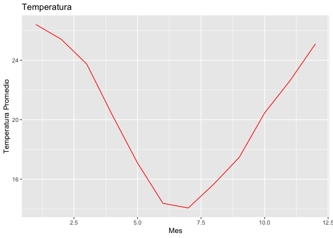

<!-- README.md is generated from README.Rmd. Please edit that file -->

# DataFocus

<!-- badges: start -->
<!-- badges: end -->

El objetivo de este paquete es a partir de un conjunto de datos y
diferentes funciones poder sacar diferentes conclusiones dependiendo de
nuestros ambiciones.

## Instalación

You can install the development version of DataFocus from
[GitHub](https://github.com/) with:

``` r
#install.packages("pak")
pak::pak("Execortesi/DataFocus")
#> ✔ Updated metadata database: 5.63 MB in 15 files.
#> ℹ Updating metadata database✔ Updating metadata database ... done
#>  
#> → Will update 1 package.
#> → Will download 1 package with unknown size.
#> + DataFocus 0.0.0.9000 → 0.0.0.9000 👷🏽‍♂️🔧 ⬇ (GitHub: 20c516a)
#> ℹ Getting 1 pkg with unknown size
#> ✔ Got DataFocus 0.0.0.9000 (source) (2.31 MB)
#> ℹ Packaging DataFocus 0.0.0.9000
#> ✔ Packaged DataFocus 0.0.0.9000 (5.3s)
#> ℹ Building DataFocus 0.0.0.9000
#> ✔ Built DataFocus 0.0.0.9000 (6.5s)
#> ✔ Installed DataFocus 0.0.0.9000 (github::Execortesi/DataFocus@20c516a) (51ms)
#> ✔ 1 pkg + 31 deps: kept 25, upd 1, dld 1 (NA B) [50.1s]
```

## Funciones

1.  `descarga-lee-Datos`: Toma el parametro que le pasemos
    correspondiente a una estación meteorológica y permite la lectura
    y/o descarga del dataset de la estación que se solicite.
2.  `grafico_temperatura_mensual`: Recibe un data set con datos de una o
    mas estaciones y devuelve un grafico con el promedio mensual de la
    temperatura de abrigo a 150 cm.
3.  `tabla_resumen_temperatura`: Recibe uno o más data sets de las
    estaciones y devuelve una tabla de resumen de la temperatura de
    abrigo a 150 cm.

## Ejemplo

Este es un ejemplo básico que muestra como instalar la librería del
paquete:

``` r
library(DataFocus)
```

## Uso de las funciones

``` r
NH0437 <- descargar_leer_datos_estacion("NH0437", "data/NH0437.csv")
```

``` r
library(ggplot2)
library(dplyr)
#> 
#> Attaching package: 'dplyr'
#> The following objects are masked from 'package:stats':
#> 
#>     filter, lag
#> The following objects are masked from 'package:base':
#> 
#>     intersect, setdiff, setequal, union
grafico_temperatura_mensual(NH0437, colores = "red", titulo = "Temperatura")
```



``` r
tabla_resumen_temperatura(NH0437)
#> # A tibble: 1 × 4
#>   id     min_temp max_temp mean_temp
#>   <chr>     <dbl>    <dbl>     <dbl>
#> 1 NH0437      2.1     36.3      20.2
```

## Autores del paquete

-Exequiel Cortesi: Estudiante de la Licenciatura en Ciencia de Datos en
la Universidad Austral de Rosario.

-Bruno Carrara: Estudiante de la Licenciatura en Ciencia de Datos en la
Universidad Austral de Rosario.
